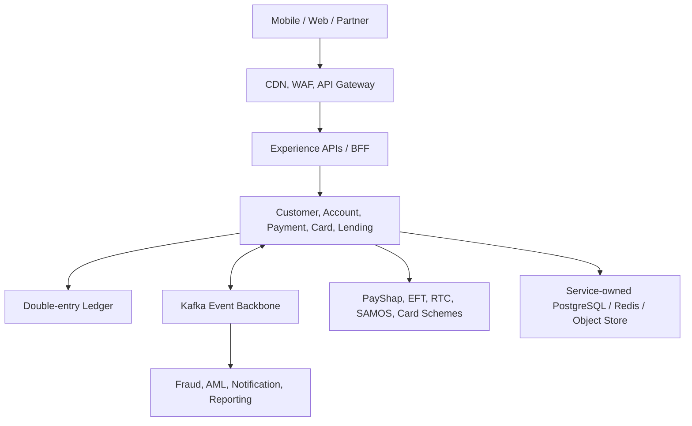

# Ubuntu Digital Bank — South Africa's Company

Senior/Lead Solution Architecture portfolio project for a resilient, inclusive and compliant South African digital bank.

## Executive summary

The target platform serves retail customers and SMEs through mobile/web channels. It supports digital onboarding, FICA/KYC, ZAR current and savings accounts, double-entry ledgering, PayShap/ShapID, EFT/RTC/SAMOS routing, cards, lending, fraud/AML, notifications, disputes, open APIs and regulatory reporting.

This repository contains:

- a complete target-state architecture and governance pack;
- a runnable Spring Boot payment vertical slice with Kafka and PostgreSQL;
- a React operations dashboard;
- OpenAPI and AsyncAPI contracts;
- bank-owned third-party ports, safe vendor failover and a local rail simulator;
- atomic multi-replica dispatch, explicit payment state machine and reconciliation controls;
- OAuth2/JWT production security with separate read/write scopes;
- concurrent-idempotency protection, leased outbox delivery, retry/backoff and dead-letter evidence;
- non-root container build, architecture fitness tests, SBOM and vulnerability CI gates;
- Kubernetes, observability, security, resilience and DR patterns;
- ADRs, interview narrative and delivery roadmap.

> This is an interview-quality reference architecture, not a licensed banking product. Production adoption requires bank-specific risk assessment, scheme certification, legal review, penetration testing, operational readiness and regulatory approval.

## Architecture at a glance



## Repository map

| Path | Purpose |
|---|---|
| `docs/architecture.md` | Target architecture, domains, NFRs, security, data and integration |
| `docs/interview-playbook.md` | 15-minute interview walkthrough and trade-off questions |
| `docs/delivery-roadmap.md` | Phased plan, teams, governance and quality gates |
| `docs/regulatory-basis.md` | Primary-source regulatory and industry design basis |
| `docs/third-party-architecture.md` | Build/buy/partner matrix, vendor governance and safe failover |
| `docs/runbooks/` | Operational response for provider and payment failures |
| `docs/reconciliation-design.md` | Intraday/settlement controls and unknown-outcome resolution |
| `docs/production-readiness-checklist.md` | Architecture, security, financial and operational release gates |
| `docs/technical-audit-v4.md` | End-to-end trace, resolved defects and explicit residual work |
| `docs/traceability-matrix.md` | Requirement-to-control-to-test evidence mapping |
| `docs/threat-model.md` | Assets, boundaries, abuse cases and security validation |
| `docs/adr/` | Architecture Decision Records |
| `contracts/` | OpenAPI and AsyncAPI source-of-truth contracts |
| `services/payment-service/` | Runnable Java 21/Spring Boot vertical slice |
| `web/` | React/Vite operations dashboard |
| `infra/` | Local dependencies, Kubernetes and observability assets |

## Quick start

Prerequisites: Docker Compose, Java 21, Maven 3.9+, Node.js 20+.

```bash
docker compose up -d postgres kafka
mvn -f services/payment-service/pom.xml spring-boot:run -Dspring-boot.run.profiles=local
curl -X POST http://localhost:8081/api/v1/payments \
  -H 'Content-Type: application/json' \
  -H 'Idempotency-Key: demo-001' \
  -d '{"debtorAccountId":"ZA-001","creditorAccountId":"ZA-002","amount":125.50,"currency":"ZAR","rail":"PAYSHAP","reference":"Portfolio demo"}'
```

Run the dashboard:

```bash
cd web
npm install
npm run dev
```

## Core design principles

1. Ledger integrity before channel convenience: immutable, balanced postings with reconciliation.
2. Zero-trust and privacy by design: strong identity, least privilege, encryption, tokenisation and audited access.
3. Event-driven, not event-only: synchronous APIs for immediate decisions; Kafka for durable propagation.
4. Every payment is idempotent, traceable and reversible through compensating entries—not record mutation.
5. Service autonomy with explicit contracts, ownership, SLOs and data classification.
6. Active-active customer channels; controlled single-writer financial domains per partition/region.

## Portfolio talking points

- Why the ledger is separated from payment orchestration.
- How transactional outbox prevents database/Kafka dual-write loss.
- Why uncertain provider outcomes must be reconciled instead of automatically retried.
- How PayShap/RTC/EFT/SAMOS routing follows value, urgency, availability and risk.
- Why fraud authorization is synchronous while case enrichment is event-driven.
- How POPIA purpose limitation, retention and breach response shape the design.
- How RTO/RPO differ by business capability rather than one blanket target.
