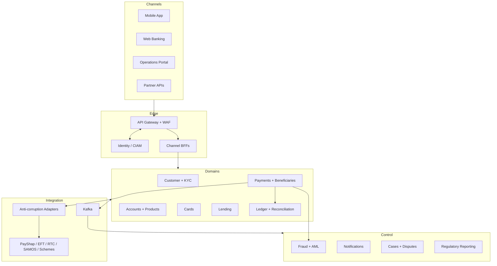
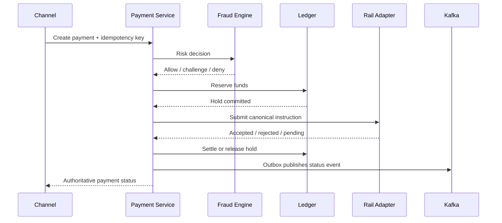

# Target Solution Architecture

## 1. Business context

Ubuntu Digital Bank targets digitally active retail customers, underserved consumers and SMEs in South Africa. Its differentiators are low-cost instant payments, transparent savings/lending, fast onboarding, multilingual accessibility and strong financial-crime controls.

### Business capabilities

| Value stream | Capabilities |
|---|---|
| Acquire | Registration, consent, identity verification, sanctions/PEP, liveness, risk rating |
| Serve | Customer profile, accounts, beneficiaries, statements, limits, preferences |
| Move money | Internal transfer, PayShap/ShapID, Request-to-Pay, EFT, RTC, SAMOS, scheduled/bulk payment |
| Pay | Virtual/physical cards, tokenisation, authorization, clearing, disputes, chargebacks |
| Grow | Savings goals, fixed deposits, lending origination, affordability, servicing, collections |
| Protect | Device trust, fraud scoring, AML monitoring, case management, transaction signing |
| Operate | General ledger, reconciliation, treasury, fees, regulatory reporting, customer support |

## 2. Architecture drivers

| Driver | Architectural response |
|---|---|
| Financial correctness | Dedicated immutable double-entry ledger; balance invariants; end-of-day and intraday reconciliation |
| Low latency | Cached read models; synchronous authorization path; regional ingress; no distributed transaction in hot path |
| Resilience | Bulkheads, timeouts, circuit breakers, queues, idempotency, backpressure and graceful degradation |
| Compliance | POPIA data controls, FICA evidence, PCI-scoped card vault, immutable audit trail and retention policies |
| Evolvability | Domain-aligned services, contract-first APIs/events, strangler-friendly adapters and ADR governance |
| Inclusion | Low-bandwidth UX, accessible design, simple language, asynchronous status and assisted onboarding |

## 3. Logical architecture

## 4. Domain and service boundaries

Each service owns its schema and exposes only versioned APIs/events. Shared databases are prohibited.

| Domain service | Owns | Key outputs |
|---|---|---|
| Customer | Party, contact, consent, lifecycle | `CustomerVerified`, `ConsentChanged` |
| KYC/FICA | Evidence, screening, risk rating, review | `KycApproved`, `ScreeningHitRaised` |
| Account | Account lifecycle, limits, available view | `AccountOpened`, `LimitChanged` |
| Product | Product catalogue, pricing, eligibility | Versioned product configuration |
| Payment | Instruction, routing, state machine | `PaymentInitiated`, `PaymentStatusChanged` |
| Ledger | Journal, posting, balances, holds | `PostingCommitted`, balance/reconciliation views |
| Card | Card/token lifecycle, authorization | ISO 8583/scheme adapters, `CardAuthorized` |
| Lending | Application, decision, loan schedule | `LoanApproved`, `RepaymentDue` |
| Fraud | Device/session/transaction risk | allow/challenge/deny decision |
| AML | Monitoring rules, alerts, investigations | case/evidence and reporting workflow |

## 5. Payment execution

Target-state payment flow is `RECEIVED → VALIDATED → RISK_APPROVED → FUNDS_RESERVED → DISPATCHING → SUBMITTED → SETTLED`. The implemented portfolio slice uses `RECEIVED → DISPATCHING → SUBMITTED`, with failure branches to `PENDING_CONFIRMATION`, `REJECTED`, or `FAILED`. Atomic compare-and-set claims prevent concurrent dispatch across replicas. Illegal transitions fail closed.

Routing policy uses amount, urgency, beneficiary reachability, operating window, cost, scheme health, fraud score and customer preference. High-value instructions must be routed through the bank-approved SAMOS path; low-value real-time flows prefer PayShap, while EFT supports non-urgent batch use cases.

## 6. Data architecture

- PostgreSQL per transactional service; serializable or explicit locking only where invariants require it.
- Transactional outbox in the same database commit as aggregate changes.
- Outbox delivery uses a short leased claim transaction; Kafka network I/O occurs outside database transactions. Each event is completed or retried independently with exponential backoff and retained dead-letter evidence.
- Kafka topics partitioned by business key (`accountId` or `paymentId`) to preserve relevant ordering.
- Redis only for ephemeral sessions, throttles and read acceleration—never authoritative balances.
- Object storage for encrypted evidence and statements with retention/legal-hold controls.
- Lakehouse receives governed, minimised CDC/events through a privacy filter; no operational service queries analytics storage.
- Data catalogue records owner, classification, purpose, retention, lineage and access policy.

### Ledger invariants

1. Every journal balances: total debits equal total credits in one currency.
2. Posted entries are immutable; corrections use compensating journals.
3. Holds and available balance are distinct from settled balance.
4. External clearing position reconciles to scheme/settlement reports.
5. All money uses decimal minor-unit-safe types; never binary floating point.

## 7. Security architecture

- CIAM: OAuth 2.1/OIDC, phishing-resistant passkeys where supported, step-up authentication and device binding.
- Workforce: federation, MFA, privileged access management, just-in-time elevation and session recording.
- APIs: mTLS service identity, short-lived tokens, audience/scopes, schema validation, rate limits and signed high-risk commands.
- Data: TLS 1.3 in transit; envelope encryption with HSM-backed keys; field-level tokenisation for identity/card data.
- Secrets: dynamic credentials, rotation and no secrets in images or Git.
- Supply chain: signed commits/images, SBOM, SAST/SCA/IaC scans, admission policy and provenance verification.
- Detection: immutable security logs, behavioural analytics, threat intelligence and automated containment playbooks.
- Segmentation: public edge, application, data, PCI cardholder-data environment, management and security zones.

### Threat examples and controls

| Threat | Controls |
|---|---|
| Account takeover | Device risk, passkeys/MFA, impossible-travel analytics, step-up, cooling-off for new beneficiaries |
| Payment replay | Idempotency key, nonce, timestamp window, request signature and state-machine guard |
| Insider data access | Purpose-based authorization, masked fields, JIT access, four-eyes approval and audit |
| Event tampering | mTLS/SASL, ACLs, schema compatibility, encryption and immutable audit correlation |
| Supply-chain compromise | Pinned dependencies, SBOM, signed artifacts, isolated build runners and deploy attestations |

## 8. Regulatory control mapping

This is an engineering mapping, not legal advice.

| Concern | Architecture evidence |
|---|---|
| POPIA | Consent/purpose register, minimisation, subject-access workflow, retention deletion, operator controls, encryption and incident workflow |
| FICA/AML/CFT | Risk-based KYC, beneficial ownership, PEP/sanctions screening, ongoing monitoring, record/evidence retention and case management |
| National Payment System | Scheme-certified adapters, participant controls, settlement/reconciliation, operational reporting and rail-specific limits |
| PCI DSS 4.0.1 | Isolated CDE, tokenisation, restricted PAN display, key custody, logging, vulnerability and access controls |
| Cloud/offshoring | Data inventory, provider due diligence, exit plan, audit rights, residency/transfer assessment, resilience and regulator engagement |

## 9. Availability and disaster recovery

| Tier | Examples | SLO | RTO | RPO |
|---|---|---:|---:|---:|
| 0 | Ledger, authorization, payment state | 99.99% | 15 min | Near-zero/≤1 min |
| 1 | Login, accounts, PayShap, fraud decision | 99.95% | 30 min | ≤5 min |
| 2 | Statements, notifications, cases | 99.9% | 4 h | ≤30 min |
| 3 | BI and non-critical batch | 99.5% | 24 h | ≤24 h |

Deployment uses multi-AZ Kubernetes and managed data services. A second South African region/site is warm, regularly restored and exercised. Financial write ownership is fenced to prevent split brain. Quarterly recovery exercises validate technology, people, suppliers, reconciliation and customer communication—not merely infrastructure failover.

## 10. Observability and operations

- OpenTelemetry traces carry `traceId`, `paymentId` and safe customer correlation; PII is excluded.
- RED metrics for APIs, USE metrics for infrastructure, Kafka lag and business SLIs.
- Business dashboards: payment acceptance, settlement latency, reconciliation breaks, fraud false-positive rate and onboarding completion.
- SLO-based alerts page only when customer impact or error-budget burn justifies interruption.
- Runbooks cover scheme outage, ledger imbalance, Kafka lag, credential compromise, data breach and regional failover.

## 11. Key trade-offs

| Decision | Benefit | Cost / mitigation |
|---|---|---|
| Domain microservices | Independent evolution and control boundaries | Platform/operational cost; start with bounded set and maturity gates |
| Kafka backbone | Durable decoupling and replay | Event governance and eventual consistency; schemas, outbox and reconciliation |
| Dedicated ledger | Strong money invariants and auditability | Extra hop; use a highly available, focused posting API |
| Tokenised card data | Reduces PCI scope | Vendor/operational dependency; dual-provider and exit planning |
| Warm DR over blind active-active writes | Avoids ledger split brain | Slower failover; automated fencing and rehearsed promotion |

## 12. Third-party boundary

External KYC, screening, credit-bureau, card, messaging and payment providers are connected through bank-owned ports and anti-corruption adapters. The domain stores bank terminology and stable references rather than vendor payloads. Provider selection is policy-based and observable. A timeout after an external instruction may have been received is treated as an indeterminate outcome: the platform performs status inquiry and reconciliation instead of retrying through another provider. See `third-party-architecture.md` and ADR-0004.
