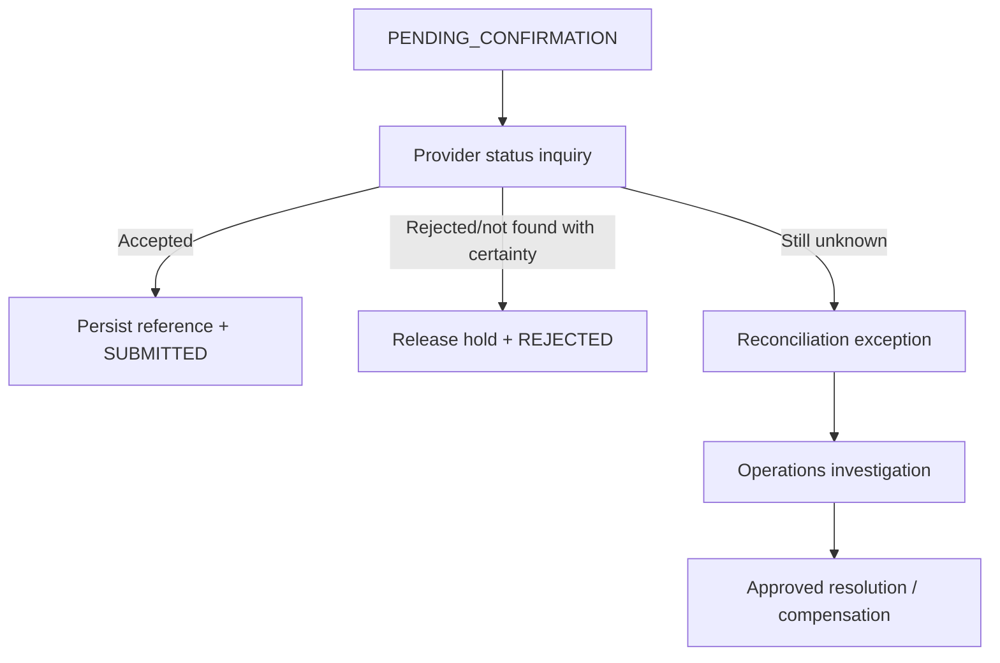

# Payment Reconciliation Design

Reconciliation is a first-class financial control, not a nightly reporting job.

## Control layers

| Layer | Comparison | Frequency | Owner |
|---|---|---|---|
| Instruction | Bank payment state vs provider status | Near real time for pending/unknown | Payments Operations |
| Transaction | Provider transaction report vs bank payment/ledger reference | Intraday + end of day | Reconciliation Service |
| Clearing | Clearing totals vs accepted transactions | Scheme cycle | Payments Control |
| Settlement | Settlement position vs ledger settlement accounts | Each settlement cycle | Treasury/Finance Control |
| Customer | Customer statement vs ledger postings/fees | Continuous + statement generation | Account/Ledger team |

## Matching hierarchy

1. Stable bank `paymentId` carried end-to-end where supported.
2. Provider external reference plus amount, currency and business date.
3. Controlled composite matching only when identifiers are missing; never auto-resolve ambiguous candidates.

## Exception lifecycle

`DETECTED → CLASSIFIED → ASSIGNED → INVESTIGATING → RESOLVED → APPROVED → CLOSED`

Material adjustments require maker-checker approval. Corrections use compensating ledger entries linked to the exception and original journal. Evidence includes input reports, matching rule/version, timestamps, actor, resolution reason and approvals.

## Unknown payment outcome

No automated resubmission occurs while acceptance remains uncertain.

