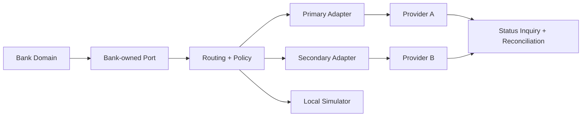

# Third-Party Architecture and Governance

## Executive decision

Third parties are required, but they must remain replaceable implementation details. The bank owns customer consent, risk policy, payment state, ledger, audit evidence, reconciliation and incident decisions. Vendor SDKs, payloads and identifiers terminate inside anti-corruption adapters.

## Build, buy and partner decisions

| Capability | Strategy | Bank retains ownership of |
|---|---|---|
| Core ledger and balances | Build/control | Posting rules, journals, balances, reconciliation and evidence |
| Payment orchestration | Build | Idempotency, routing policy, payment state and exceptions |
| PayShap/EFT/RTC/SAMOS connectivity | Partner/certified integration | Canonical model, controls, limits, settlement and reconciliation |
| Identity verification/liveness | Multi-vendor buy | Consent, evidence reference, acceptance policy and manual review |
| AML/PEP/sanctions data | Buy data/service | Risk policy, match disposition, cases and regulatory accountability |
| Credit bureau | Multi-bureau integration | Affordability/credit policy, model governance and adverse-action reason |
| Card processing/tokenisation | Partner | Customer/card lifecycle, authorization policy, disputes and settlement controls |
| Notifications | Commodity multi-provider | Templates, consent, delivery policy and sensitive-data minimisation |
| Fraud tooling | Hybrid | Decision policy, features, override governance and outcome monitoring |
| Cloud/HSM/SIEM | Buy managed capability | Key policy, access, monitoring, resilience and exit plan |

## Safe failover policy

| Failure class | Meaning | Action |
|---|---|---|
| Pre-send/unavailable | Provider definitely did not receive instruction | Fail over if scheme, customer consent and routing policy permit |
| Definitive rejection | Provider processed and rejected instruction | Do not retry through another provider; return controlled rejection |
| Indeterminate outcome | Timeout/disconnect after possible acceptance | Freeze automatic retry, mark `PENDING_CONFIRMATION`, query status and reconcile |
| Accepted/pending | Provider returned an external reference | Persist reference; subsequent action uses inquiry, not a new submission |

This distinction prevents a timeout from becoming two successful payments.

## Vendor control lifecycle

1. **Discover:** classification, data flow, criticality, concentration and regulatory impact.
2. **Due diligence:** security, privacy, financial health, subcontractors, data location, BCP/DR and certifications.
3. **Contract:** measurable SLA/SLO, audit rights, incident notification, deletion/return, liability, change notice and exit assistance.
4. **Integrate:** port/adapter, mTLS, OAuth, allowlisting, schema validation, minimised payload and correlation ID.
5. **Operate:** synthetic checks, error budget, latency, reconciliation, vendor scorecard and capacity monitoring.
6. **Exit:** data export, key revocation, traffic migration, evidence preservation and verified deletion.

## Minimum onboarding evidence

- Data-processing inventory and POPIA role assessment.
- Cross-border transfer/offshoring decision and approved data locations.
- Threat model, penetration evidence and software supply-chain review.
- RTO/RPO alignment, recovery test evidence and subcontractor dependencies.
- Named service owner, risk owner, data owner and exit-plan owner.
- Production credentials held in a secrets manager with rotation and emergency revocation.
- Contract tests, sandbox certification and negative/failure test pack.

## Concentration controls

Dual sourcing is justified for high-impact capabilities where two providers truly reduce shared failure risk. It is not automatic: two providers on the same cloud, network or upstream data source may create the illusion of resilience. The architecture records correlated dependencies and tests failover under realistic conditions.

